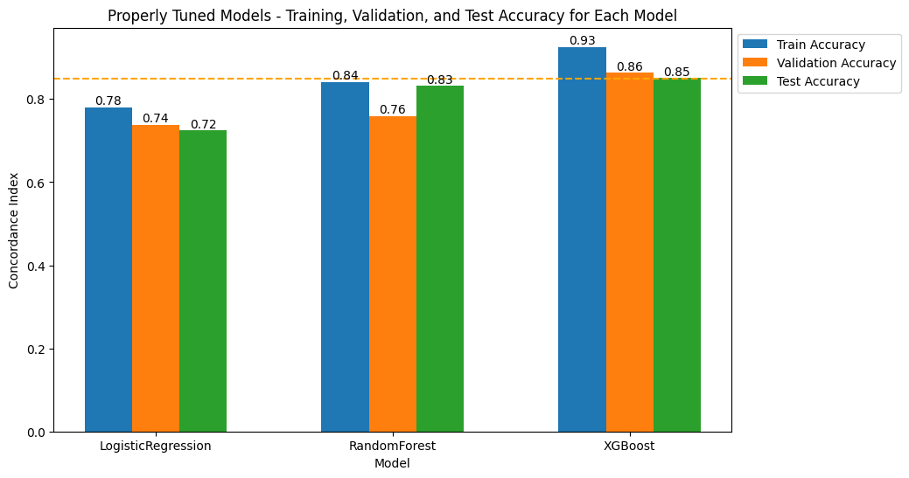
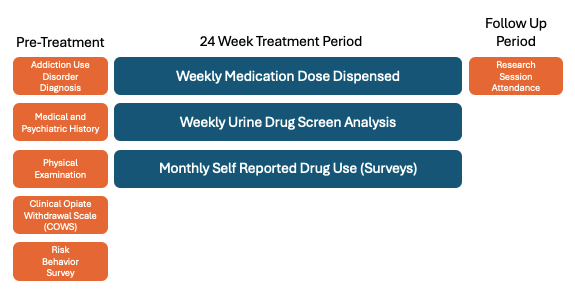
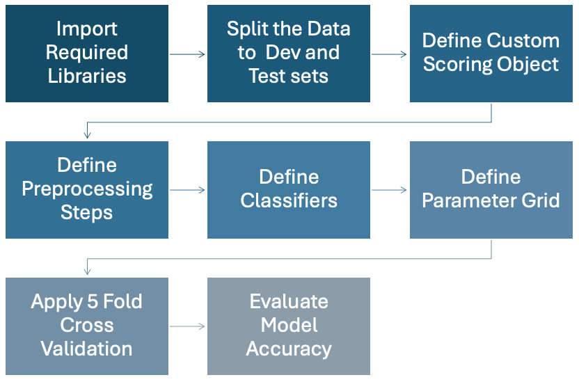
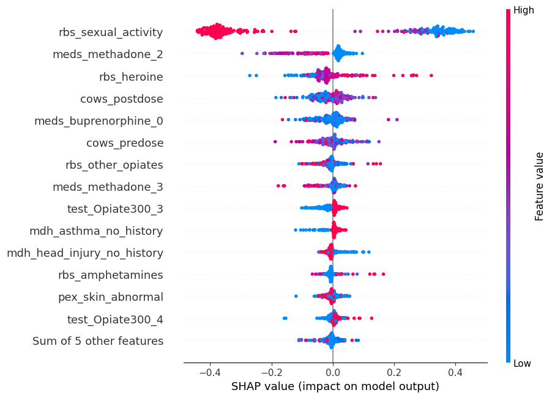

# Precision Medicine: Applying State of the Art Machine Learning to Opioid Use Disorder Treatment

    

 

# Project Introduction (Currently WIP, will be complete on 8/9/2024)
There is a public health crisis in the US where 6 million people are suffering from opioid use disorder (OUD).  
There is a effective treatment available in the form of medication treatment for OUD (MOUD). 
However, there are problems with patient dropout, where treatment is not personalized and 50% of patients relapse and don't complete treatment. 
 
A prognostic model that can predict risk for relapse early in treatment would be clinically useful. 
 
For this project, I built a prognostic model that can detect risk for relapse at week 4 of a 32 week treatment period.  I built a high quality dataset, using public dataset [CTN-0027](https://datashare.nida.nih.gov/study/nida-ctn-0027).  The dataset included treatment data for 1,321 patients, receiving treatment during a 32 week period. 
 
To evaluate model accuracy I will use the concordance index.  A common metric used to measure the ability of a risk model to properly assign risk to patients with health outcomes. 
 
I have provided a brief tutorial for each of the critical components of the project, including data wrangling, exploratory analysis, machine learning pipelines, and shapley values. 

# Results
I successfully trained a machine learning model to predict risk for dropout early in treatment with 85% accuracy at week 4 of a 32 week treatment period.  

  

 
In order to train the model for accuracy, I built a high quality dataset, including data collected from patients during a pre-treatment assessment period and the first 4 weeks of treatment. 
 
To find the best model, I built pipelines to feed 3 different classifiers.  The classifier with the best accuracy was XGBoost, a gradient boosted decision tree model, that shows superior accuracy for classification problems with structured data. 
 
To interpret the model output, I used the SHAP Python library, which uses Shapley values to explain the impact of key features on the model output. 

# Data Wrangling
The data wrangling process required labeling 11 different tables from a de-identified publicly available dataset.  
 
The complete ETL pipeline script is available here in the code directory.

The image below is a high level representation of the data model.

  

Each table received between 5 - 8 different treatments, listed as follows: 
1. Load the data 
2. Identify columns that require labels 
3. Apply labels to columns 
4. Drop columns that are not needed 
5. Apply transformations to values where required 
6. Feature Engineering (if necessary) 
7. Flatten Dataframes (Reshape from deep to wide format) 
8. Merge with other tables 
 
I created 5 reusable functions to automate most of the work. They are listed as follows: 

## List of Reusable Functions
All functions are stored in the helper.py file in the `code` directory. 

| Name of Function | Description | 
| ---------------- | ----------- |
| clean_df | Clean the given DataFrame by dropping unnecessary columns, renaming columns, and reordering columns. |
| flatten_dataframe | This function separates treatment data into dataframes.  Each week of treatment is separated into it's own dataframe.  Columns are updated to reflect the week of treatment, then all columns are merged to form a new dataset, taking the dataset from a deep to wide shape, required for machine learning |
| merge_dfs | Merge the given list of DataFrames into one DataFrame. |
| uds_features | Creates 4 new features which are metrics used to measure outcomes from opiate test data. |
| med_features | Creates 2 new features for medication dose to enrich dataset and improve accuracy in machine learning|

# Exploratory Analysis
There are a total of 61 features in the dataset.  Please refer to the data dictionary to observe all features and the descriptive statistics. 
 To observe the complete exploratory analysis, please refer to the article on Medium, undert the "Exploratory Analysis" section

# Machine Learning Pipelines
The following workflow was executed in Python and can be referenced in a neatly documented Jupyter Notebook in the code directory.

  

# Shapley Values

  

# File Directory

Please refer to the [file directory](pages/tree.md) below for the complete project structure.

